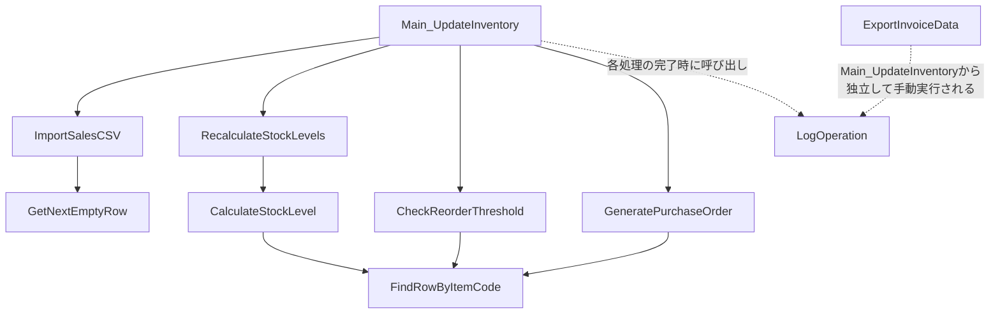

# VBA仕様書復元 納品サンプル(架空データ)

対象:`inventory_macro_sample.bas`(在庫管理・自動発注マクロ、架空の業務データを想定)
規模:約300行 → A2単価表の「小」区分(〜500行/30,000円)相当のサンプル。

本書は自動抽出スケルトン(`structure_skeleton.md`)に、コード全文を読んだ上での
意味記述を追記したものである。現代化提案(改修すべきという推奨)は含まない。

## 1. 処理フロー図

補足:`ExportInvoiceData`は`Main_UpdateInventory`から呼び出されておらず、
請求データ出力が必要な月末のみ単独実行される運用と推定される
(コード上、呼び出し元が存在しないため)。

## 2. 関数/サブルーチン一覧と役割
| 種別 | 名前 | 引数 | 戻り値 | 役割 |
|---|---|---|---|---|
| Sub | Main_UpdateInventory | (なし) | — | CSV選択ダイアログを表示し、取込→在庫再計算→発注判定→発注書生成を順に実行する統括処理 |
| Sub | ImportSalesCSV | filePath | — | 外部CSV(販売実績)を開き、販売ログシートの末尾に1行ずつ転記する。金額(数量×単価)もこの時点で計算する |
| Sub | RecalculateStockLevels | (なし) | — | 商品マスタの全品目について現在庫数を再計算し、在庫状況シートに書き戻す |
| Function | CalculateStockLevel | itemCode | Long | 商品マスタの初期在庫数から、販売ログの累計出荷数量を差し引いた現在庫を算出する |
| Function | FindRowByItemCode | ws, itemCode | Long | 指定シート内で商品コードが一致する行番号を線形探索で返す(見つからない場合0) |
| Sub | CheckReorderThreshold | (なし) | — | 在庫状況シートの各品目について、しきい値(個別設定 or 既定値20)を下回る場合に「要発注」フラグを立てる |
| Sub | GeneratePurchaseOrder | (なし) | — | 「要発注」フラグの品目を発注書シートに転記する。発注数量は個別設定 or 既定値50 |
| Sub | ExportInvoiceData | (なし) | — | 当月分の販売ログをCSVファイルとして出力する(請求データ用) |
| Function | GetNextEmptyRow | ws | Long | 指定シートのA列末尾の次の空き行番号を返す |
| Sub | LogOperation | message | — | 処理ログシートに実行時刻とメッセージを1行追記する簡易ロガー |

## 3. 入出力仕様
### 入力
- 外部CSV(販売実績):`Main_UpdateInventory`実行時にファイル選択ダイアログ経由で指定。
  列構成は「販売日, 商品コード, 数量, 単価」の4列を前提(ヘッダー行あり、`ImportSalesCSV`が
  2行目以降を読み取る)
- 商品マスタシート(A:商品コード, B:商品名, C:初期在庫数, D:個別しきい値(任意),
  E:個別発注数(任意))

### 出力
- 販売ログシート:CSV取込内容 + 計算済み金額列
- 在庫状況シート:商品コード・商品名・現在庫数・更新日時・要発注フラグ
- 発注書シート:要発注品目の商品コード・商品名・現在庫数・発注数量・発注日
- 請求データCSV(`ExportInvoiceData`実行時のみ):`ThisWorkbook.Path`配下に
  `invoice_YYYYMM.csv`として出力

### 外部リソース参照
- `Workbooks.Open`:販売実績CSVを読み取り専用で開く(`ImportSalesCSV`)
- `Scripting.FileSystemObject`:請求データCSVの書き出し(`ExportInvoiceData`)
- DB接続(ADODB等):使用なし

## 4. 改修時の影響範囲・リスク指摘書
事実と評価を分離して記載する。以下は現状仕様の指摘であり、改修提案ではない。

| 箇所 | 事実 | リスク評価 |
|---|---|---|
| シート名参照 | `Const SHEET_*`でシート名を一括定義しているが、実体は`ThisWorkbook.Sheets(定数)`による文字列一致 | シート名がブック内で変更されると、該当シートが見つからず実行時エラーになる。エラーハンドリングなし |
| `FindRowByItemCode` | 全行を線形探索(O(n)) | 商品マスタ・在庫状況の行数が数千件規模になった場合、処理時間が線形に増加する。現状データ規模(想定数十〜数百品目)では問題なし |
| `LogOperation` | `On Error Resume Next`でログシート取得失敗を握りつぶしている | ログシートが存在しない/リネームされた場合、ログが記録されないまま処理が継続する。障害時の追跡が困難になる |
| `ImportSalesCSV` | CSVの列順・列数が前提と異なる場合の検証なし | 列がずれたCSVを取り込むと、誤った数量・単価が販売ログに記録される。取込時のバリデーションなし |
| `ExportInvoiceData` | 出力ファイルを`True`(上書き許可)でオープン | 同名ファイルが既に存在する場合、確認なく上書きされる |
| 排他制御 | 複数ユーザーによる同時実行を想定した排他制御なし | 共有ブックで複数人が同時に`Main_UpdateInventory`を実行すると、在庫状況シートへの書き込みが競合する可能性がある |

## 5. 現代化提案について
本納品物の対象範囲外である。現代化提案(クラウド化・DB化・UI改善等)は別途
「A2-拡張」として商品化を検討中であり、本レポートには含めない。
