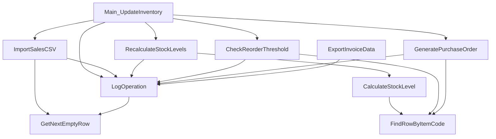

# VBA構造抽出スケルトン(自動生成・要:意味記述の追記)

対象ファイル: inventory_macro_sample.bas
抽出方式: 正規表現によるベストエフォート抽出。ネストしたコメントアウト・条件コンパイルは
考慮していないため、本スケルトンの内容は人力で必ず現物のExcel実機と突合すること
(A2運用手順の実行フロー「人力検証」を省略しない)。

## 1. 検出したSub/Function一覧
| 種別 | 名前 | 引数 | 戻り値 |
|---|---|---|---|
| Sub | Main_UpdateInventory | (なし) | — |
| Sub | ImportSalesCSV | filePath As String | — |
| Sub | RecalculateStockLevels | (なし) | — |
| Function | CalculateStockLevel | itemCode As String | Long |
| Function | FindRowByItemCode | ws As Worksheet, itemCode As String | Long |
| Sub | CheckReorderThreshold | (なし) | — |
| Sub | GeneratePurchaseOrder | (なし) | — |
| Sub | ExportInvoiceData | (なし) | — |
| Function | GetNextEmptyRow | ws As Worksheet | Long |
| Sub | LogOperation | message As String | — |

役割列は本スケルトンに含まれない。Claudeが各Subの処理内容を読み、
「関数/サブルーチン一覧と役割」として役割列を追記すること(prompt-template.md参照)。

## 2. 呼び出し関係(簡易・ベストエフォート、処理フロー図のたたき台)

自動抽出は単純な名前一致によるものであり、Property経由の間接呼び出し・
On Error GoTo によるフロー分岐は反映されていない。Claudeが実処理を読み、
正しい処理フロー図に修正すること。

## 3. 検出したセル/シート参照
- Range/Cells呼び出し: Cells(wsSrc.Rows.Count, "A"), Cells(destRow, 1), Cells(srcRow, 1), Cells(destRow, 2), Cells(srcRow, 2), Cells(destRow, 3), Cells(srcRow, 3), Cells(destRow, 4), Cells(srcRow, 4), Cells(destRow, 5), Cells(wsMaster.Rows.Count, "A"), Cells(r, 1), Cells(r, 2), Cells(r, 3), Cells(r, 4), Cells(masterRow, 3), Cells(wsSalesLog.Rows.Count, "B"), Cells(ws.Rows.Count, "A"), Cells(wsStock.Rows.Count, "A"), Cells(masterRow, 4), Cells(r, 5), Cells(wsPO.Rows.Count, "A"), Range("A2:E" & clearLastRow), Cells(masterRow, 5), Cells(poRow, 1), Cells(poRow, 2), Cells(poRow, 3), Cells(poRow, 4), Cells(poRow, 5), Cells(wsSalesLog.Rows.Count, "A"), Cells(1, 1), Cells(nextRow, 1), Cells(nextRow, 2)
- シート名参照: 検出なし

## 4. 検出した外部リソース参照
- Workbooks.Open
- FileSystemObject

## 5. 未実装セクション(Claudeが追記する範囲)
- 各Sub/Functionの処理内容の説明(上記1表の「役割」相当)
- 入出力仕様の意味的整理(何のためのセル範囲か・データの流れ)
- 改修時の影響範囲・リスク指摘書(事実と評価を分離して記載。A2運用手順の注意事項準拠。
  「改修すべき」という推奨は書かない)
